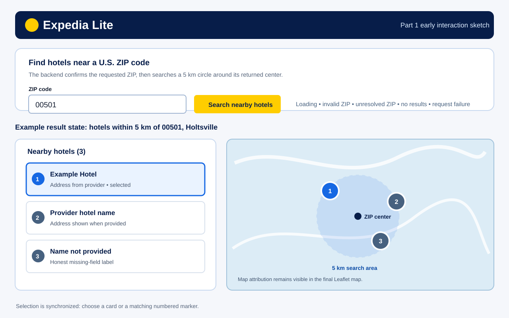

# Assignment 2 Part 1 — Research and design notes

## Sources consulted

- [Geoapify Geocoding API](https://apidocs.geoapify.com/docs/geocoding/) documents `type=postcode`, country filters, and latitude/longitude results. Its guidance recommends a country filter because postcodes are only unique within a country.
- [Geoapify Places API](https://apidocs.geoapify.com/docs/places/) documents the `accommodation.hotel` category and circle filters measured in metres.
- [Leaflet Quick Start](https://leafletjs.com/examples/quick-start/) documents a defined-height map container, markers, event handlers, and required tile attribution.
- [California Preferred Hotel Program interactive map](https://www.dgs.ca.gov/-/media/Divisions/OFAM/Statewide-Travel-Program/Resources/Lodging---PHP/PHP-Interactive-Map.pdf) shows a familiar hotel-map pattern: a visible list and map that remain aligned with the same search.

## Useful patterns and omissions

The researched map/list pattern makes the result list scannable while giving people spatial context. It is useful only when the selected result stays visually connected to its marker. Map and place providers can have incomplete names or addresses, so the interface must label missing information instead of filling it in. A map should also identify its search area and retain attribution.

The application deliberately omits price, rating, availability, and booking claims because the Places response does not establish them. It also does not promise an exhaustive hotel inventory: Geoapify coverage and fields vary by area.

## Decisions adopted for Expedia Lite

- The traveler enters an exact five-digit U.S. ZIP code, preserving leading zeros. FastAPI first verifies that Geoapify resolved that requested U.S. postcode before it asks for hotels.
- FastAPI searches only a 5 km circle around the returned postcode coordinates using `accommodation.hotel`. The UI names the returned postcode/locality as the search center.
- A single selected provider place ID drives both the selected list row and selected map marker. List items are keyboard buttons; marker clicks select the same item.
- The UI keeps invalid input, unresolved ZIP, provider failure, no-nearby-results, loading, and results as distinct states. It never treats a service failure as an empty successful search.
- The map uses Leaflet with visible OpenStreetMap attribution. The backend Geoapify key remains in the project-root `.env`; it is never sent to Vue.

## Early mockup

This early sketch shows the intended ZIP search, state feedback, synchronized cards and markers, and the 5 km search-center label. The final implementation may refine spacing and colors, but keeps these behaviors.
