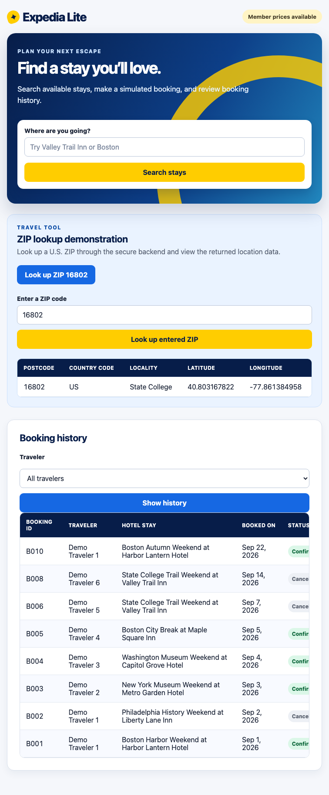

# Public API ZIP activity evidence

## Safe configuration check

`GET /api/health` reported `geoapify: key is configured`. The API key value and `.env` contents were not displayed or included in this evidence.

## Direct backend check

`GET /api/zip-location?postcode=16802` returned a resolved U.S. location for `16802`: State College, PA, with latitude `40.803167822` and longitude `-77.861384958`.

## Browser checks

The retained **Look up ZIP 16802** button called the local `/api/demo/zip-location` route and displayed the resolved location. The real ZIP input was entered with `16802`; it called the local entered-ZIP route and displayed the returned postcode, country code, locality, latitude, and longitude in the table below.

