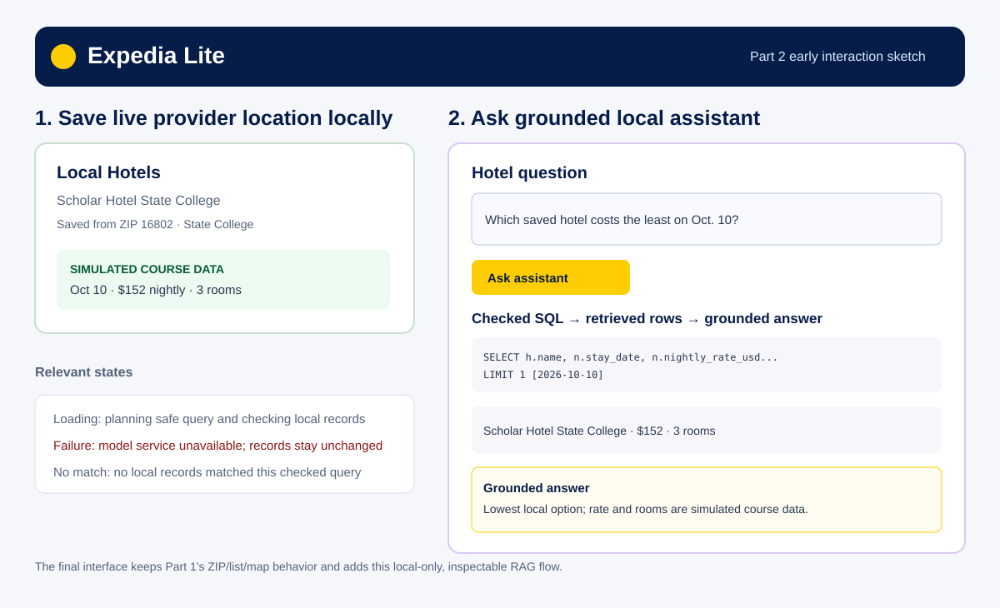

# Expedia Lite — Assignment 2 Part 2

## Project access

Repository URL: https://github.com/abn54/Travel-app

Assessed Part 2 commit: [`f4ff41815069af22eed329ee0e8383b147b37669`](https://github.com/abn54/Travel-app/commit/f4ff41815069af22eed329ee0e8383b147b37669)

To run locally, install `backend/requirements.txt`, run `uvicorn app:app --reload --port 8000` from `backend/`, then run `npm install` and `npm run dev` from `frontend/`. The project-root `.env` contains backend-only `GEOAPIFY_API_KEY` and `OPENROUTER_API_KEY` values. Restart FastAPI after editing `.env`. Neither key is committed or sent to Vue.

## Research notes

[Part 2 research notes](docs/assignment2-part2-research.md) document the OpenRouter free-model availability strategy, SQLite read-only query design, relevant sources, risks, and resulting decisions. The application first tries the selected free Nemotron model and uses OpenRouter's free router only if the selected free endpoint is unavailable.

## Early mockup

The early sketch planned visible local storage, simulated-data labels, and an inspectable chatbot response with the question, checked SQL, retrieved records, and answer. The implemented interface retains those elements, plus loading, no-match, and safe failure feedback.

## Screen-recorded demo video

[Watch the Assignment 2 Part 2 demo](https://psu.mediaspace.kaltura.com/media/t/1_5lx8yxiu). The video shows: ZIP `16802` provider results; **Add to Local**; the saved local hotel and its labeled simulated dates/rates/rooms; the successful October 10 assistant question; the displayed SQL, retrieved record, and grounded answer; then the Miami no-match state. It does not show `.env` or either key.

## Implementation

Part 1's ZIP search, provider list, and Leaflet map remain unchanged. Part 2 adds `local_hotels` and `demo_hotel_nights` SQLite tables. A saved provider location uses its provider place ID as the local primary key, preventing duplicates. The backend creates seven dated rows of clearly labeled simulated course nightly rates and room availability for each newly saved hotel; they are not claims of live provider inventory.

The Vue assistant submits a natural-language question to FastAPI. The backend sends the question, safe local schema, and SQL rules to OpenRouter. It accepts and validates one bounded `SELECT` over only the local hotel/demo-night tables, executes it through a SQLite read-only connection, and sends the original question plus retrieved rows to the LLM for a grounded answer. Vue displays the question, proposed SQL, query parameters, retrieved records, and answer. The assistant cannot book or alter database records.

## Verification record

| Date and action | Expected result | Observed result |
| --- | --- | --- |
| October 3, 2026 — save first `16802` provider result, then save it again | One location is saved with seven dated simulated course records; duplicate save creates no second row. | Scholar Hotel State College was saved from the live State College provider result. The first save returned `created: true`, gave October 10–16 rates/rooms, and the duplicate-protection controller test passed. |
| October 3, 2026 — successful browser question: “Which saved hotel has the lowest simulated nightly rate on 2026-10-10?” | The UI shows the question, an LLM-proposed bounded `SELECT`, matching local record, and a grounded answer. | The checked SQL joined `local_hotels` and `demo_hotel_nights`, used the `2026-10-10` parameter and `LIMIT 1`, then returned Scholar Hotel State College at $152 with 3 simulated rooms. The browser displayed the SQL, one row, and the grounded answer. |
| October 3, 2026 — browser question for Miami on 2026-10-10 | Successful checked query with no records is distinct from an error. | The proposed bounded query returned zero rows and the UI said no saved local Miami records matched, with no provider or database error. |
| Mocked valid, no-match, provider-failure, and write-query paths | The full RAG flow is repeatable; a write proposal cannot change SQLite. | 32 automated checks passed. The mocked success has a recorded question → SQL → row → answer workflow in [the fixed JSON fixture](docs/fixtures/assignment2-part2-chat-success.json). A `DELETE` proposal was rejected before database execution, and a model-provider failure maps to a safe 502 response. |
| Automated local-storage checks — duplicate save, removal, and reopened SQLite database | A provider place ID saves once, removal deletes its related demo nights, and saved state persists after browser/backend restarts. | The local-storage controller checks passed: duplicate saves did not create a second row; removal deleted the hotel and its dated demo nights; reopening the SQLite database preserved saved records. |
| October 3, 2026 — production build and safe configuration check | The frontend builds; health reports configuration status without exposing values. | Vite built successfully. `/api/health` reported the Geoapify and OpenRouter keys as configured without returning either key. |

Free-model availability can vary. The browser distinguishes a provider failure from a local no-match result, and the fixed fixture makes the core workflow repeatable without a live model request.

## AI disclosure and evidence log

- Codex, based on GPT-5, was used to inspect the project, research official OpenRouter and SQLite documentation, implement the local SQLite and backend-only RAG layers, create tests and docs, and run local verification.
- [Selected prompts](prompts/selected-prompts.md) record the assignment requests that led to this work. During verification, the selected free model initially produced visible reasoning instead of the requested SQL JSON; the planner was revised to request JSON mode with reasoning disabled. The backend still validates every proposal before execution.
- The first live free-model endpoint was intermittently unavailable. The implementation retains a same-provider OpenRouter free-router fallback and presents a safe failure state if both attempts fail.
- Geoapify provided the saved location only. OpenRouter generated the SQL proposal and grounded wording. The application labels the stored rates and room counts as simulated course data and excludes `.env` values from source, reports, and browser output.

## Project context and next steps

- [README](README.md)
- [Project instructions](AGENTS.md)
- [Design note](docs/design.md)
- [Part 2 research](docs/assignment2-part2-research.md)
- [Part 2 fixed fixture](docs/fixtures/assignment2-part2-chat-success.json)
- [Selected prompts](prompts/selected-prompts.md)
- [Current handoff](handoffs/current.md)

Remaining limitation: all nightly rates and rooms are intentionally simulated course data, and free model availability varies. Next: record the demonstration, add its accessible URL above, and upload this `report.md`.
